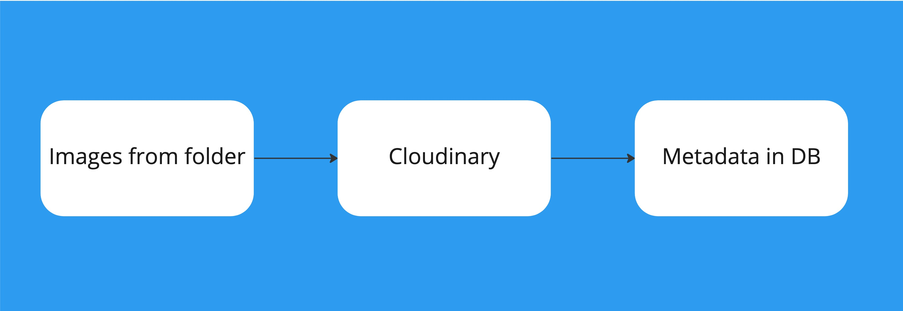

# Overview

Suppliers should be able to upload images of their display units. This implementation focuses on bulk uploads of images which will happen independently of uploading unit catalogs (spreadsheets containing units).

For a more flexible experience, suppliers may perform the following activities in any order:

1. Upload a folder containing images
1. Upload spreadsheets containing units

The image(s) corresponding to a particular unit, if the images have been uploaded already, will be retrieved. If the images have not been uploaded, they can be uploaded at any time.

## Unit Uploads

The application already supports uploading billboard units via a spreadsheet. The spreadsheet contains unit information including a unique `reference_id` and other information including unit type, location etc.

```
Note: The unique reference_id is used to locate the images belonging to a unit. For a unit with reference_id R0001 for example, images R0001.png, R0001_north.png and R0001_aerial-view.png for example will be linked to this unit.
```

## Bulk Image Upload

Images for units can be uploaded in bulk by selecting multiple images from a folder. The images are uploaded to Cloudinary CDN and the metadata for each uploaded image is returned and saved in the local database; the metadata includes the URL to these images.



## Billboard Image

This is the image model that houses the images for billboard units uploaded by suppliers.

```
This model already exists but will now be modified to support a more flexible bulk upload scenario. The major changes will include dropping the FK constraint to Billboard Unit which will give us a de-coupled approach to uploading images.
```

| Field         | Description                                           |
| ------------- | ----------------------------------------------------- |
| reference_id  | The reference ID to the Unit                          |
| image(\_url)  | Image (URL) field, currently returned from cloudinary |
| original_name | The name of the image file uploaded                   |

`Note` Lookup will be by reference_id to avoid a more expensive prefix-based search. Optionally, this table can be moved to elasticsearch for a more flexible search experience in the future.

Bulk image upload will have this workflow:

1. User upload images from the application, selecting multiple images at a time
1. The images are uploaded to Cloudinary CDN, which returns metadata, including the image URL, original name and other useful information
1. The returned information are stored in the database BillboardImage (UnitImage) table.

```
Note: image names will always have the unique unit reference ID as a preference otherwise lookup for unit images will fail.
```

For example, a unit with reference_id R0001 can have images with the following names:

- r0001.png
- r0001-aerialview.jpg
- r0001-north.png

In addition:

- The spreadsheet already supports a Reference ID for units. (e.g REFXXXX_abuja.png). This will remain unchanged.
- The Reference ID's are unique on our system, that helps in mapping images to the actual units.
- Uploading units and bulk images can happen in any order.
- User has to select all (Cltr + A) the images in the folder (selecting a folder itself is not supported).
- The response object from cloudinary can be queried to get the name of the image that was actually uploaded.
- A progress bar or text is displayed during the upload/submit action(AJAX). The responses are saved in the Image Model.
